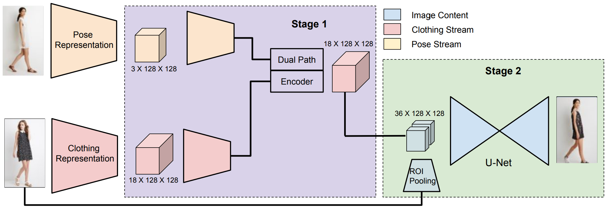

# SwapNet
Unofficial PyTorch reproduction of SwapNet.




For more than a year, I've put all my efforts into reproducing SwapNet (Raj et al. 2018). By making my implementation public, I hope to contribute to transparency and openness in the Deep Learning community.

See the original paper [here](http://www.eye.gatech.edu/swapnet/paper.pdf).

# Installation
This repository is built with PyTorch. I recommend installing dependencies via conda.

Run `conda create env` from the project directory to create the `swapnet` conda environment from the provided environment.yml.

# Dataset
Data in this repository must start with the following:
- `texture/` folder containing the original images. Images may be directly under this folder or in sub directories.

The following must then be added from preprocessing(see the Preprocessing section below):
- `body/` folder containing preprocessed body segmentations 
- `cloth/` folder containing preprocessed cloth segmentations
- `rois.csv` which contains the regions of interest for texture pooling
- `norm_stats.json` which contain mean and standard deviation statistics for normalization

The images under 

## Deep Fashion
The dataset cited in the original paper is [DeepFashion: In-shop Clothes Retrieval](http://mmlab.ie.cuhk.edu.hk/projects/DeepFashion/InShopRetrieval.html). Only the images are needed for this repository. Once downloaded, move the image files under `data/deep_fashion/texture`.

## (Optional) Create Your Own Dataset
If you'd like to take your own pictures, move the data into `data/YOUR_DATASET/texture`.

# Preprocessing
the images must be preprocessed into BODY and CLOTH segmentation representations. These will be input for training and inference.

## Body Preprocessing
The original paper cited Unite the People (UP) to obtain body segmentations; however, I ran into trouble installing Caffe to make UP work (probably due to its age). 
Therefore, I instead use Neural Body Fitting (NBF). [My fork of NBF](https://github.com/andrewjong/neural_body_fitting-for-SwapNet) modifies the code to output body segmentations and ROIs in the format that SwapNet requires. 

1) Follow the instructions in my fork. You must follow the instructions under "Setup" and "How to run for SwapNet". Note NBF uses TensorFlow; I suggest using a separate conda environment for NBF's dependencies.

2) Move the output under `data/deep_fashion/body/`, and the generated rois.csv file to `data/deep_fashion/rois.csv`.

*Caveats:* neural body fitting appears to not do well on images that do not show the full body. In addition, the provided model seems it was only trained on one body type. I'm open to finding better alternatives.

## Cloth Preprocessing
The original paper used [LIP\_SSL](https://github.com/Engineering-Course/LIP_SSL). I instead use the implementation from the follow-up paper, [LIP\_JPPNet](https://arxiv.org/pdf/1804.01984.pdf). Again, [my fork of LIP\_JPPNet](https://github.com/andrewjong/LIP_JPPNet-for-SwapNet) outputs cloth segmentations in the format required for SwapNet.

1) Follow the installation instructions in the repository. Then follow the instructions under the `For SwapNet` section.

2) Move the output under `data/deep_fashion/cloth/`

# Calculate Normalization Statistics
This calculates normalization statistics for the preprocessed body image segmentations, under `body/`, and original images, under `texture/`. The cloth segmentations do not need to be processed because they're read as 1-hot encoded labels.

Run the following: `python util/calculate_imagedir_stats.py data/deep_fashion/body/ data/deep_fashion/texture/`. The output should show up in `data/deep_fashion/norm_stats.json`.

# Training

1) Train warp stage
```
python train.py --name warp_stage --model warp --dataroot data/deep_fashion
```

2) Train texture stage
```
python train.py --name texture_stage --model texture --dataroot data/deep_fashion
```

# Inference
Inference will run the warp stage and texture stage in series.

```
python inference.py --warp_checkpoint checkpoints/warp_stage/[generator_name.pth] --texture_checkpoint checkpoints/texture_stage/[generator_name.pth] --cloth_dir [SOURCE] --texture_dir [SOURCE] --body_dir [TARGET]
```


# Credits
- The layout of this repository is strongly influenced by Jun-Yan Zhu's [pytorch-CycleGAN-and-pix2pix](https://github.com/junyanz/pytorch-CycleGAN-and-pix2pix) repository, though I've implemented significant changes. Many thanks to their team for open sourcing their code.
- Many thanks to Amit Raj for patiently responding to my questions throughout the year.
